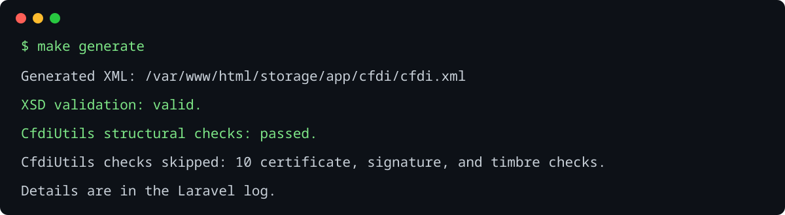

# CFDI 4.0 Generator

A focused Laravel technical test that converts structured JSON into a CFDI 4.0 `Ingreso` XML and validates it locally. It is a demonstration, not an invoicing system.

## Requirements

- Docker Compose
- GNU Make
- Permission to use Docker

The Laravel application lives in `laravel/`. Docker supplies PHP 8.4, Composer, `bcmath`, DOM, libxml, XSL, `curl`, and `bzip2`.

## Run

From the repository root:

```bash
make setup
make generate
```

`make setup` builds the image, installs Composer dependencies, and downloads the pinned PhpCfdi SAT catalog resource with SHA-256 verification. `make generate` uses [input.json](laravel/resources/examples/input.json) and writes the tracked deliverable to [cfdi.xml](laravel/storage/app/cfdi/cfdi.xml).

Useful commands:

```bash
make test
make format
make catalogs-update
```

`catalogs-update` refreshes the configured pinned catalog release; it never silently downloads an unpinned `latest` version.

## Command outcomes

Successful generation writes the XML and reports the three validation layers:



The included [invalid IVA example](laravel/resources/examples/invalid-iva.json) demonstrates a concise input-contract failure and non-zero exit status:


## What is implemented

- `cfdi:40:generate <input>` validates JSON, calculates values with `bcmath`, creates XML through `DOMDocument`, writes `storage/app/cfdi/cfdi.xml`, and returns a non-zero status on failure.
- The supported model is CFDI 4.0 `Ingreso` (`TipoDeComprobante=I`) with one IVA `Traslado` per `Concepto`.
- The supplied input produces `SubTotal=8026.46`, IVA before document rounding of `1284.233600`, and `Total=9310.69`.
- The generated document uses locally stored official SAT XSD dependencies. Its catalog resource is installed once into ignored `storage/app/sat/`, so XML generation and validation run offline afterwards.

## Validation model

1. Input, SAT catalog, and supported filling-guide checks are command gates.
2. `DOMDocument::schemaValidate()` performs local CFDI 4.0 XSD validation and reports line, column, and message on failure.
3. CfdiUtils adds advisory structural checks. Certificate, signature, and `TimbreFiscalDigital` checks are logged as skipped because they are intentionally out of scope.

## Design

`App\Services\Cfdi\V40` separates input validation, type-specific calculation, XML construction, XSD validation, catalog lookup, and advisory checks. `Ingreso` is the only implemented type; compact dispatchers allow a later type to add its own validator and calculator without changing `Ingreso` behavior.

All monetary inputs remain decimal strings. Concept amounts and IVA use six decimal places; document totals use two decimal places and round half up. PHP floats are never used.

## Future implementation path

These capabilities are intentionally not enabled in this test:

| Capability | Candidate tool | Notes |
| --- | --- | --- |
| CSD handling, `cadena de origen`, signature checks | Installed `eclipxe/cfdiutils` | The library also supports CFDI creation/reading, certificate helpers, XSD and signature validation. Real private-key handling requires secure secret storage. |
| Additional local SAT rules and document types | Installed `phpcfdi/sat-catalogos` with `resources-sat-catalogs` | Provides queryable, versioned SAT catalog data; each CFDI type still needs its own filling-guide rules. |
| Timbrado, cancellation, and stamped XML retrieval | InvoiceOne SOAP integration | InvoiceOne publishes CFDI 4.0 [timbrado](https://www.invoiceone.com.mx/soporte/servicio-de-timbrado/) and [cancellation/retrieval services](https://invoiceone.mx/TimbreCFDI/timbrecfdi.asmx). A production integration requires provider credentials, CSD/PFX policy, retries, persistence, and audit controls. |
| API, UI, users, and persistence | Laravel features already available in the framework | Add only when the product requires them; they are deliberately absent here. |

## Out of scope

PAC integration, timbrado, CSD files, real certificates, real signatures, `TimbreFiscalDigital`, databases, authentication, APIs, UI, queues, retentions, discounts, complements, and unsupported CFDI types.

Structural XSD validity is not legal or fiscal validity, SAT acceptance, or PAC acceptance. Do not use the generated XML as an invoice.

For project decisions, see [PROJECT.md](PROJECT.md).
